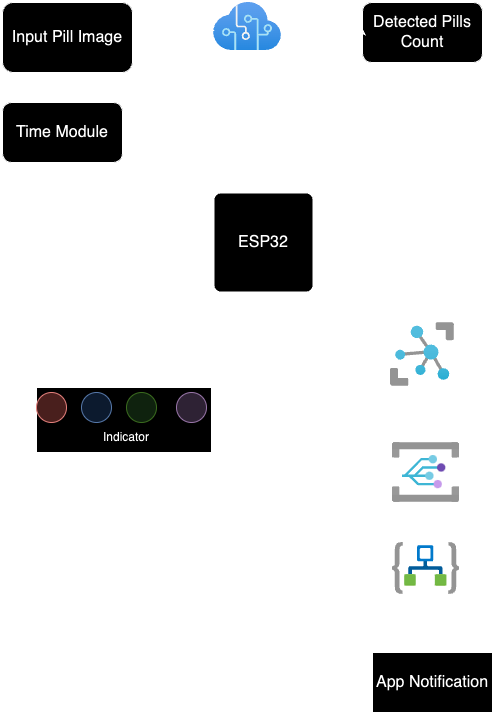
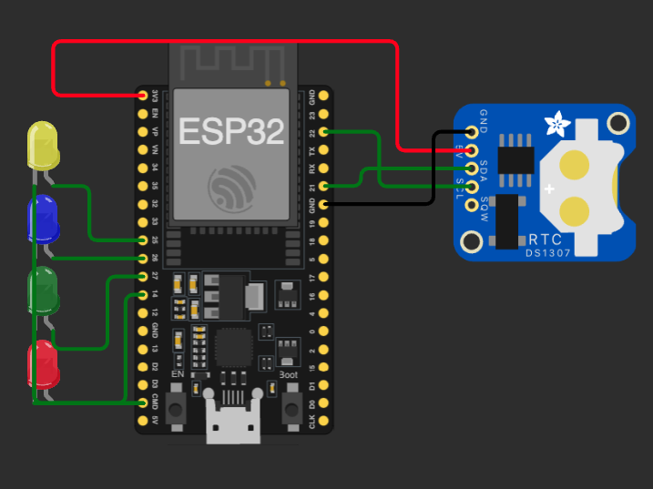

# MED-Punctual


## Description

This project introduces a novel pill box titled MedPunctual, designed to deliver pills punctually, monitor daily health, and count pills. Unlike traditional pill boxes, MedPunctual employs Azure computer vision to detect and quantify pills, categorizing them based on user preferences. Additionally, through Azure IoT, the device monitors vital signs such as blood pressure, heart rate, and oxygen saturation, generating a comprehensive health report correlating with pill intake. The device's mechanical design enables the storage of various medicines in multiple layers, featuring an LED screen and a finger slot with embedded sensors for health monitoring. MedPunctual facilitates routine checkups and pill intake based on prescribed medicines, stored in a multi-accessible database. One device can serve multiple users, ensuring health monitoring and pill intake for each family member. Connected to an app, MedPunctual allows users to schedule medicine intake, health monitoring, and notify pill count. The app, divided into patient and doctor sections, enables physicians to remotely monitor patients, suggest medications, and assess overall progress of medicine intake. The app serves as a communication platform between doctors and patients, providing statistical visualizations to address changes in health conditions. Furthermore this device can predict chances of hypertension, heart disease, stroke, kidney disease. MedPunctual aims to assist the elderly and disabled in medication adherence and regular health monitoring. Moreover, it can find applications in medical centers and hospitals, enhancing nursing assistance through technological integration. Ongoing developments focus on refining the device's design for increased complexity and portability, expanding its utility in the medical industry.

## Architecture


## Getting Started
## App Prototype
[Figma File](https://www.figma.com/proto/8OhqDdYlSTACAcVMj7hqC1/MedPunctual?type=design&node-id=1-2&t=VrEMtMuUTHxc323l-1&scaling=scale-down&page-id=0%3A1&starting-point-node-id=1%3A2)
### Dependencies

- Python 3.8 (for `azure_custom_vision.py`)
- ESP32 Development Board
- Arduino IDE for ESP32 programming (`time_module_esp32.ino`)
- Any necessary libraries for 3D printing software to handle the models in the `3D Models` folder
- An Azure account with Custom Vision Service set up for the Python script

### Installing

#### Software

1. **Clone the Project:**
   - First, clone the repository to your local machine:
     ```shell
     git clone https://github.com/nihalbaig0/MED-Punctual.git
     cd MED-Punctual
     ```

2. **Python Environment Setup:**
   - Ensure Python is installed on your system.
   - Create a virtual environment in the project directory:
     ```shell
     python -m venv venv
     ```
   - Activate the virtual environment:
     - On Windows:
       ```shell
       .\venv\Scripts\activate
       ```
     - On Unix or MacOS:
       ```shell
       source venv/bin/activate
       ```
   - Install required Python libraries using the `requirements.txt` file:
     ```shell
     pip install -r requirements.txt
     ```
    
3. **Arduino Environment Setup:**
   - Install the [Arduino IDE](https://www.arduino.cc/en/software) compatible with your system.
   - Follow the instructions to install the ESP32 board into your Arduino IDE: [ESP32 Board Installation Guide](https://randomnerdtutorials.com/installing-the-esp32-board-in-arduino-ide-windows-instructions/)
   - Install the [RTC](https://github.com/Makuna/Rtc/wiki) library via the Arduino Library Manager.

#### Hardware

- Prepare your ESP32 development board and any necessary connections to the RTC module as required by `time_module_esp32.ino`.



### Running the Project

1. **Azure Custom Vision Python Script:**
   - Before running `azure_custom_vision.py`, ensure you have set up your Azure Custom Vision project and have your endpoint and keys ready.

   ```
   ENDPOINT = ""      
   PREDICTION_KEY = ""
   PROJECT_ID = ""
   MODEL_NAME = ""

   ```
   - Update `azure_custom_vision.py` with your specific Azure Custom Vision project details.
   - Run the script:
     ```shell
     streamlit run azure_custom_vision.py
     ```

2. **ESP32 Time Module:**
   - Open `time_module_esp32.ino` in the Arduino IDE.
   - Select the correct port and board (ESP32) under Tools.
   - Upload the code to your ESP32.

3. **3D Models:**
   - The `3D Models` folder contains all models necessary for this project. Use compatible 3D printing software to open and print these models.

## Contributing

If you'd like to contribute to the project, please fork the repository and create a pull request with your changes. You're also welcome to submit issues for any bugs found or features suggested.

## License

This project is licensed under the [INSERT LICENSE HERE] License - see the LICENSE.md file for details.

## Acknowledgments

- Mention any inspirations, code snippets, etc.
- Any collaborators or contributors
- External resources or communities that helped

